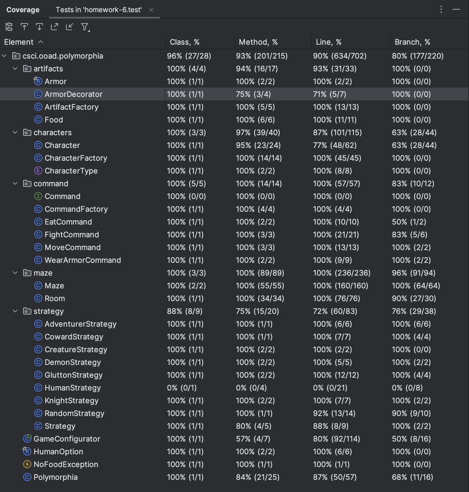

[](https://classroom.github.com/a/MktpU50_)
# OOAD Homework 8:
## Extending Polymorphia with a Decorator pattern and Human player
#### (55 points)

High Level TODOs:
- Create a static main
- Use the Decorator Pattern to implement Armor
- Create and place Armor (5 points)
- ArtifactFactory (5 points)
- ArmoredCharacter (15 points)
- Create Random Strategy (5 points)
- Create Human Strategy (15 points)
- Create a Command-line Interface in a static main method (10 points)

Armor and the Decorator Pattern
- Knights can now wear armor
- If the character loses a fight, it will lose 1 less health point because the armor protects them.
- There is no limit to the number of armored suits a character can wear, but make sure that an armored character cannot gain health if they lose a fight.
An armored character loses 0.1 more health points (per armored suit worn) when it moves, due to the weight of the armor.

Create a Random Strategy
- Create a strategy that will randomly select an action from all the possible actions for the character in their current circumstances (room). Make this the default strategy for Adventurers (not knights, gluttons, or cowards).


### Introduction
#### Team Members: 
Grace Ohlsen, Sierra Reschke and Nolan Brady 

#### Java Version: 21

#### Comments/Assumptions: 
Assumptions:
* We assumed the Knight picked up armor if there was no creature in the room. 
* All options will be printed for each human turn; however, the option will only be executed if it is a viable option
* The command line arguments passed to initialize the game will have letters corresponding to those in getOptions

Command line arguments for human-playable game:
--numberOfRooms 9 
--numberOfAdventurers 4 
--numberOfCreatures 5 
--numberOfDemons 1 
--numberOfFoodItems 5 
--numberOfArmor 4  
--humanPlayer "Sierra Reschke"
* Since testing human input or related functionality is prohibitive we left those methods uncovered in our tests. This includes methods outside of HumanStrategy that are designed to handle the prompting or logic surrounding that interation.
* Files involves are: Character, HumanStrategy, Strategy, and GameConfigurator.
* loseFightDamage (the method missing from ArmorDecorator) also shows as being uncovered but is covered in the test in ArmorTest.java. We're not sure why it isn't registering as covered.
* See below for example output of game play, demonstrating move, eat, fight, and wear armor options and their corresponding logger outputs and health modifications

## Test Coverage


## Grading Rubric:

### Deductions

    NOTE: for this assignment you do NOT need to worry about method coverage and you do NOT need to submit a screenshot of the coverage

* Meaningful names for everything: variables, methods, classes, interfaces, etc. (1% off for each bad name, up to 10% total)
* No "magic" numbers or strings (1% off for each one, up to 10%)
* No System.out.println() calls anywhere in your main code – replace with logging (see below) or eliminate outright. 1% off for each System.out.println statement in src/main/java code.
* 1% deduction for each missing required addition to the README.md (game outputs, screenshots, diagrams)

### Method Construction Possible Deductions (max is listed under Required Capabilities)

Methods should be:
* "short" -- with very few exceptions all methods should fit on a screen using a readable font.
* well named (duh).
* properly denoted as instance methods vs. static methods (static methods don't reference the _this_ pointer).
* limited complexity (level of indentation due to control structures).
* not have comments that could be turned into just as readable code.

All of this can be achieved through functional decomposition of more complicated methods (see lecture on October 2nd).

## Game Extensions
* If adventurers are in the room with the Demon, the Demon will fight the healthiest one
* If no adventurers are in the room, the Demon will move to a random neighboring room

### Required Capabilities

* Use the Strategy Pattern to inject behavior into the Adventurer class so that we can create Characters that behave like our previous subclasses of Knight, Glutton, and Coward. (15 points)
* Use the Strategy Pattern to do the same with Demon subclass of Creature. (5 points)
* Use the Command Pattern to return the action to execute from the Strategy Pattern classes (20 points)
* Use the Factory Pattern to create the Command objects (5 points)


### Example game output demonstrating eat, move, fight, and wear armor commands
```agsl
The game has started.
Polymorphia Polymorphia Game 1 after turn 0
# of live adventurers: 5
# of live creatures: 6
	Goblin's Fountain:
		Dragon(health: 3)

	Dragon's Den:
		Arwen(health: 5)
		Ogre(health: 3)
		Sierra Reschke(health: 5)
		Endersteel Leggings armor

	Troll Bridge:
		Matt(health: 5)
		Obsidian Shield armor

	Dungeon:
		Frodo(health: 5)
		Satan(health: 15)

	Pit of Despair:
		Orc(health: 3)
		salad(1.2)

	Sanctuary:
		Nikhil(health: 5)
		Shelob(health: 3)
		cupcake(1.7)
		steak(1.3)
		Blazeborn Helm armor

	Den of Souls:
		Troll(health: 3)

	Map Room:
		apple(1.4)
		banana(1.1)

	Fangorn Forest:
		Netherite Chestplate armor
Starting play...
Frodo(health: 5) is fighting Satan(health: 15)
Frodo(health: 5) rolled 2
Satan(health: 15) rolled 5
FightOutcome: Satan won a battle against Frodo
Satan(health: 14.5) is fighting Frodo(health: 1.5)
Satan(health: 14.5) rolled 3
Frodo(health: 1.5) rolled 2
FightOutcome: Satan won a battle against Frodo
Frodo just died!
Nikhil(health: 5) is fighting Shelob(health: 3)
Nikhil(health: 5) rolled 4
Shelob(health: 3) rolled 6
FightOutcome: Shelob won a battle against Nikhil
Matt moved from Troll Bridge to Fangorn Forest
Moved: Matt moved from Troll Bridge to Fangorn Forest
You are in room 	Dragon's Den:
Arwen(health: 5)
Ogre(health: 3)
Sierra Reschke(health: 5)
Endersteel Leggings armor

1: Eat
2: Fight
3: Move
4: Put on armor
5: Do Nothing
Enter your option: 3
Sierra Reschke moved from Dragon's Den to Den of Souls
Moved: Sierra Reschke moved from Dragon's Den to Den of Souls
Arwen(health: 5) is fighting Ogre(health: 3)
Arwen(health: 5) rolled 2
Ogre(health: 3) rolled 5
FightOutcome: Ogre won a battle against Arwen
Polymorphia Polymorphia Game 1 after turn 1
# of live adventurers: 4
# of live creatures: 6
	Goblin's Fountain:
		Dragon(health: 3)

	Dragon's Den:
		Arwen(health: 1.5)
		Ogre(health: 2.5)
		Endersteel Leggings armor

	Troll Bridge:
		Obsidian Shield armor

	Dungeon:
		Satan(health: 14)

	Pit of Despair:
		Orc(health: 3)
		salad(1.2)

	Sanctuary:
		Nikhil(health: 2.5)
		Shelob(health: 2.5)
		cupcake(1.7)
		steak(1.3)
		Blazeborn Helm armor

	Den of Souls:
		Troll(health: 3)
		Sierra Reschke(health: 4.75)

	Map Room:
		apple(1.4)
		banana(1.1)

	Fangorn Forest:
		Matt(health: 4.75)
		Netherite Chestplate armor
Satan moved from Dungeon to Den of Souls
Moved: Satan moved from Dungeon to Den of Souls
Nikhil(health: 2.5) is fighting Shelob(health: 2.5)
Nikhil(health: 2.5) rolled 5
Shelob(health: 2.5) rolled 6
FightOutcome: Shelob won a battle against Nikhil
Arwen(health: 1.5) is fighting Ogre(health: 2.5)
Arwen(health: 1.5) rolled 2
Ogre(health: 2.5) rolled 6
FightOutcome: Ogre won a battle against Arwen
Arwen just died!
Matt moved from Fangorn Forest to Goblin's Fountain
Moved: Matt moved from Fangorn Forest to Goblin's Fountain
You are in room 	Den of Souls:
Troll(health: 3)
Sierra Reschke(health: 4.75)
Satan(health: 13.75)

1: Eat
2: Fight
3: Move
4: Put on armor
5: Do Nothing
Enter your option: 2
Sierra Reschke(health: 4.75) is fighting Satan(health: 13.75)
Sierra Reschke(health: 4.75) rolled 6
Satan(health: 13.75) rolled 3
FightOutcome: Sierra Reschke won a battle against Satan
Polymorphia Polymorphia Game 1 after turn 2
# of live adventurers: 3
# of live creatures: 6
	Goblin's Fountain:
		Dragon(health: 3)
		Matt(health: 4.5)

	Dragon's Den:
		Ogre(health: 2)
		Endersteel Leggings armor

	Troll Bridge:
		Obsidian Shield armor

	Dungeon:
		

	Pit of Despair:
		Orc(health: 3)
		salad(1.2)

	Sanctuary:
		Nikhil(health: 1)
		Shelob(health: 2)
		cupcake(1.7)
		steak(1.3)
		Blazeborn Helm armor

	Den of Souls:
		Troll(health: 3)
		Sierra Reschke(health: 4.25)
		Satan(health: 10.25)

	Map Room:
		apple(1.4)
		banana(1.1)

	Fangorn Forest:
		Netherite Chestplate armor
You are in room 	Den of Souls:
Troll(health: 3)
Sierra Reschke(health: 4.25)
Satan(health: 10.25)

1: Eat
2: Fight
3: Move
4: Put on armor
5: Do Nothing
Enter your option: 3
Sierra Reschke moved from Den of Souls to Troll Bridge
Moved: Sierra Reschke moved from Den of Souls to Troll Bridge
Satan moved from Den of Souls to Sanctuary
Moved: Satan moved from Den of Souls to Sanctuary
Nikhil(health: 1) is fighting Satan(health: 10)
Nikhil(health: 1) rolled 5
Satan(health: 10) rolled 1
FightOutcome: Nikhil won a battle against Satan
Matt(health: 4.5) is fighting Dragon(health: 3)
Matt(health: 4.5) rolled 6
Dragon(health: 3) rolled 3
FightOutcome: Matt won a battle against Dragon
Dragon just died!
Polymorphia Polymorphia Game 1 after turn 3
# of live adventurers: 3
# of live creatures: 5
	Goblin's Fountain:
		Matt(health: 4)

	Dragon's Den:
		Ogre(health: 2)
		Endersteel Leggings armor

	Troll Bridge:
		Sierra Reschke(health: 4)
		Obsidian Shield armor

	Dungeon:
		

	Pit of Despair:
		Orc(health: 3)
		salad(1.2)

	Sanctuary:
		Nikhil(health: 0.5)
		Shelob(health: 2)
		Satan(health: 5.5)
		cupcake(1.7)
		steak(1.3)
		Blazeborn Helm armor

	Den of Souls:
		Troll(health: 3)

	Map Room:
		apple(1.4)
		banana(1.1)

	Fangorn Forest:
		Netherite Chestplate armor
Nikhil(health: 0.5) is fighting Satan(health: 5.5)
Nikhil(health: 0.5) rolled 5
Satan(health: 5.5) rolled 2
FightOutcome: Nikhil won a battle against Satan
Nikhil just died!
Matt moved from Goblin's Fountain to Fangorn Forest
Moved: Matt moved from Goblin's Fountain to Fangorn Forest
Satan moved from Sanctuary to Dungeon
Moved: Satan moved from Sanctuary to Dungeon
You are in room 	Troll Bridge:
Sierra Reschke(health: 4)
Obsidian Shield armor

1: Eat
2: Fight
3: Move
4: Put on armor
5: Do Nothing
Enter your option: 4
Polymorphia Polymorphia Game 1 after turn 4
# of live adventurers: 2
# of live creatures: 5
	Goblin's Fountain:
		

	Dragon's Den:
		Ogre(health: 2)
		Endersteel Leggings armor

	Troll Bridge:
		Sierra Reschke wearing armor(health: 4)

	Dungeon:
		Satan(health: 1.75)

	Pit of Despair:
		Orc(health: 3)
		salad(1.2)

	Sanctuary:
		Shelob(health: 2)
		cupcake(1.7)
		steak(1.3)
		Blazeborn Helm armor

	Den of Souls:
		Troll(health: 3)

	Map Room:
		apple(1.4)
		banana(1.1)

	Fangorn Forest:
		Matt(health: 3.75)
		Netherite Chestplate armor
Matt moved from Fangorn Forest to Troll Bridge
Moved: Matt moved from Fangorn Forest to Troll Bridge
You are in room 	Troll Bridge:
Sierra Reschke wearing armor(health: 4)
Matt(health: 3.5)

1: Eat
2: Fight
3: Move
4: Put on armor
5: Do Nothing
Enter your option: 3
Sierra Reschke wearing armor moved from Troll Bridge to Sanctuary
Moved: Sierra Reschke wearing armor moved from Troll Bridge to Sanctuary
Satan moved from Dungeon to Troll Bridge
Moved: Satan moved from Dungeon to Troll Bridge
Polymorphia Polymorphia Game 1 after turn 5
# of live adventurers: 2
# of live creatures: 5
	Goblin's Fountain:
		

	Dragon's Den:
		Ogre(health: 2)
		Endersteel Leggings armor

	Troll Bridge:
		Matt(health: 3.5)
		Satan(health: 1.5)

	Dungeon:
		

	Pit of Despair:
		Orc(health: 3)
		salad(1.2)

	Sanctuary:
		Shelob(health: 2)
		Sierra Reschke wearing armor(health: 4)
		cupcake(1.7)
		steak(1.3)
		Blazeborn Helm armor

	Den of Souls:
		Troll(health: 3)

	Map Room:
		apple(1.4)
		banana(1.1)

	Fangorn Forest:
		Netherite Chestplate armor
You are in room 	Sanctuary:
Shelob(health: 2)
Sierra Reschke wearing armor(health: 4)
cupcake(1.7)
steak(1.3)
Blazeborn Helm armor

1: Eat
2: Fight
3: Move
4: Put on armor
5: Do Nothing
Enter your option: 1
Sierra Reschke wearing armor gained health: 5.68
AteSomething: Sierra Reschke wearing armor just ate cupcake
Satan(health: 1.5) is fighting Matt(health: 3.5)
Satan(health: 1.5) rolled 5
Matt(health: 3.5) rolled 5
FightOutcome: Satan tied in a battle against Matt
Matt(health: 3) is fighting Satan(health: 1)
Matt(health: 3) rolled 3
Satan(health: 1) rolled 1
FightOutcome: Matt won a battle against Satan
Satan just died!
Polymorphia Polymorphia Game 1 after turn 6
# of live adventurers: 2
# of live creatures: 4
	Goblin's Fountain:
		

	Dragon's Den:
		Ogre(health: 2)
		Endersteel Leggings armor

	Troll Bridge:
		Matt(health: 2.5)

	Dungeon:
		

	Pit of Despair:
		Orc(health: 3)
		salad(1.2)

	Sanctuary:
		Shelob(health: 2)
		Sierra Reschke wearing armor(health: 5.68)
		steak(1.3)
		Blazeborn Helm armor

	Den of Souls:
		Troll(health: 3)

	Map Room:
		apple(1.4)
		banana(1.1)

	Fangorn Forest:
		Netherite Chestplate armor
You are in room 	Sanctuary:
Shelob(health: 2)
Sierra Reschke wearing armor(health: 5.68)
steak(1.3)
Blazeborn Helm armor

1: Eat
2: Fight
3: Move
4: Put on armor
5: Do Nothing
Enter your option: 3
Sierra Reschke wearing armor moved from Sanctuary to Dragon's Den
Moved: Sierra Reschke wearing armor moved from Sanctuary to Dragon's Den
Matt moved from Troll Bridge to Pit of Despair
Moved: Matt moved from Troll Bridge to Pit of Despair
Polymorphia Polymorphia Game 1 after turn 7
# of live adventurers: 2
# of live creatures: 4
	Goblin's Fountain:
		

	Dragon's Den:
		Ogre(health: 2)
		Sierra Reschke wearing armor(health: 5.68)
		Endersteel Leggings armor

	Troll Bridge:
		

	Dungeon:
		

	Pit of Despair:
		Orc(health: 3)
		Matt(health: 2.25)
		salad(1.2)

	Sanctuary:
		Shelob(health: 2)
		steak(1.3)
		Blazeborn Helm armor

	Den of Souls:
		Troll(health: 3)

	Map Room:
		apple(1.4)
		banana(1.1)

	Fangorn Forest:
		Netherite Chestplate armor
Matt(health: 2.25) is fighting Orc(health: 3)
Matt(health: 2.25) rolled 2
Orc(health: 3) rolled 5
FightOutcome: Orc won a battle against Matt
Matt just died!
You are in room 	Dragon's Den:
Ogre(health: 2)
Sierra Reschke wearing armor(health: 5.68)
Endersteel Leggings armor

1: Eat
2: Fight
3: Move
4: Put on armor
5: Do Nothing
Enter your option: 2
Sierra Reschke wearing armor(health: 5.68) is fighting Ogre(health: 2)
Sierra Reschke wearing armor(health: 5.68) rolled 4
Ogre(health: 2) rolled 5
FightOutcome: Ogre won a battle against Sierra Reschke wearing armor
Polymorphia Polymorphia Game 1 after turn 8
# of live adventurers: 1
# of live creatures: 4
	Goblin's Fountain:
		

	Dragon's Den:
		Ogre(health: 1.5)
		Sierra Reschke wearing armor(health: 5.18)
		Endersteel Leggings armor

	Troll Bridge:
		

	Dungeon:
		

	Pit of Despair:
		Orc(health: 2.5)
		salad(1.2)

	Sanctuary:
		Shelob(health: 2)
		steak(1.3)
		Blazeborn Helm armor

	Den of Souls:
		Troll(health: 3)

	Map Room:
		apple(1.4)
		banana(1.1)

	Fangorn Forest:
		Netherite Chestplate armor
You are in room 	Dragon's Den:
Ogre(health: 1.5)
Sierra Reschke wearing armor(health: 5.18)
Endersteel Leggings armor

1: Eat
2: Fight
3: Move
4: Put on armor
5: Do Nothing
Enter your option: 
```
